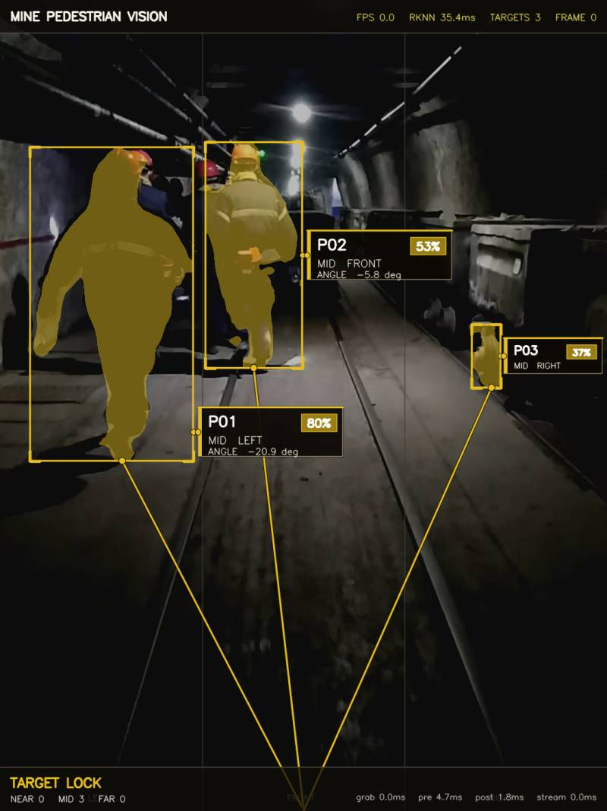
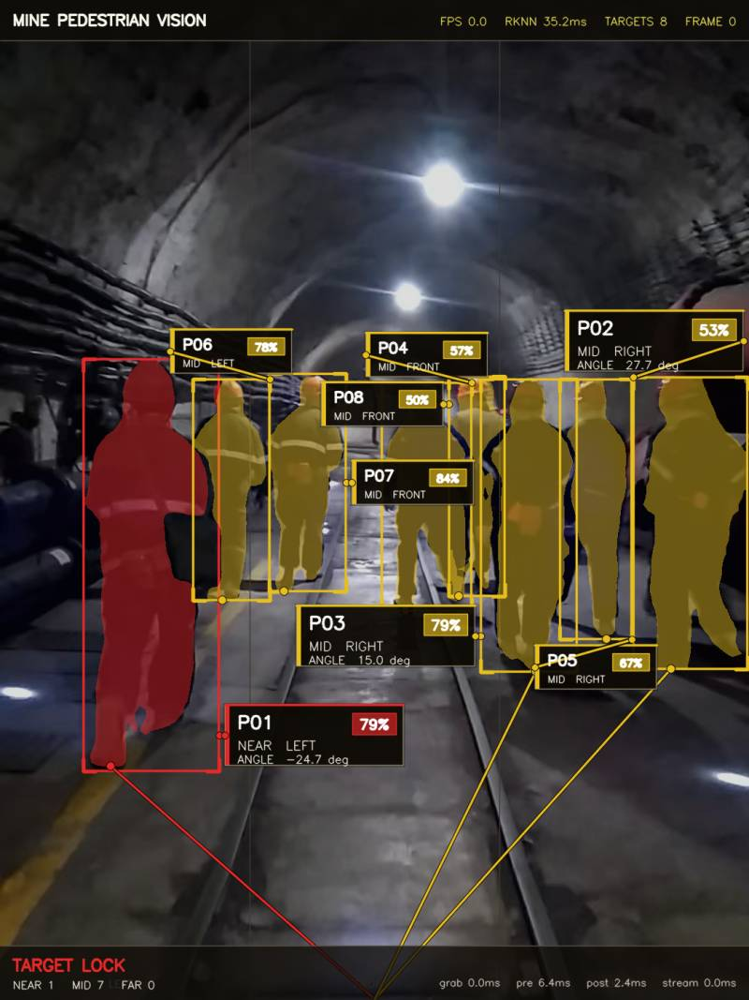
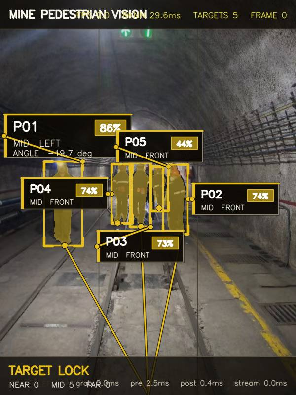

# Mine Pedestrian Vision


面向矿洞行人检测避障原型的边缘视觉工程。Orange Pi 5 Pro / RK3588 接入海康威视 GigE 工业相机，RKNN NPU 实时运行 YOLOv8 segmentation，输出行人框、分割 mask、脚底像素点、左右方向和近/中/远粗距离分区，并通过 MJPEG 流实时可视化。

**开机自启动 | USB转RS485行人数据传输 | CLI统一管理 | 可配置推流IP**

## Demo

| 近处重点目标 | 多目标矿洞场景 | 复杂背景场景 |
| --- | --- | --- |
|  |  |  |

## 系统架构与数据流

```
┌─────────────────────────────────────────────────────────────────┐
│                        Orange Pi 5 Pro (RK3588)                  │
│                                                                  │
│  ┌──────────┐    ┌──────────────────┐    ┌───────────────────┐  │
│  │ GigE     │    │ mine_live_infer  │    │ web/              │  │
│  │ Camera   │───▶│ (C++ RKNN NPU)   │───▶│ live_targets.json │  │
│  │ 192.168  │    │ YOLOv8-seg 推理  │    │ live_result.jpg   │  │
│  │ .10.2    │    └──────────────────┘    └───────┬───────────┘  │
│  └──────────┘                                    │              │
│                                                  │              │
│                    ┌─────────────────────────────┘              │
│                    │                                            │
│         ┌──────────▼──────────┐                                 │
│         │   MJPEG Server      │                                 │
│         │   :8090/stream      │──── HTTP ──▶ 浏览器/客户端      │
│         └─────────────────────┘                                 │
│                                                                  │
│         ┌─────────────────────┐                                 │
│         │ mine_rs485.py       │                                 │
│         │ 读取 live_targets.  │       USB-to-RS485              │
│         │ json 格式化协议帧   │──────▶ /dev/ttyUSB0 ──▶ 下位机  │
│         └─────────────────────┘        (CH340/FT232)     (PLC/  │
│                                              │             MCU) │
│                                          RS485 总线              │
│                                          A+ ─── 绿/白            │
│                                          B- ─── 绿               │
│                                          GND ── 黑               │
└─────────────────────────────────────────────────────────────────┘
```

### 数据如何通过 USB 转 RS485 发送

1. **推理产出**: `mine_live_infer` (C++ NPU推理程序) 每帧将检测结果写入 `web/live_targets.json`
2. **轮询读取**: `mine_rs485.py` 持续监控该JSON文件，发现新帧号即读取
3. **协议封装**: 每个行人的检测信息按 NMEA 风格格式化为一帧 ASCII 报文
4. **串口发送**: 通过 Python `pyserial` 写入 `/dev/ttyUSB0`（USB转485适配器）
5. **RS485传输**: CH340/FT232 芯片将 USB 信号转为 RS485 差分信号 (A+/B-)，通过双绞线发送到下位机（PLC/MCU/工控机）

**无适配器时自动切换模拟模式**：如果 `/dev/ttyUSB0` 不存在，程序仅在日志中打印数据帧，不会报错退出。

## Hardware

| Component | Value |
| --- | --- |
| Board | Orange Pi 5 Pro |
| SoC | Rockchip RK3588 |
| Camera | Hikrobot MV-CU013-A0GC GigE |
| Board Wi-Fi / SSH | `192.168.1.5` |
| Board Ethernet | `192.168.10.1/24` |
| Camera IP | `192.168.10.2/24` |
| USB-to-RS485 | CH340 / FT232 / CP2102 模块 |
| Project path | `/home/orangepi/moonxkj/mine_pedestrian` |

## Quick Start

```bash
cd /home/orangepi/moonxkj/mine_pedestrian

# 可选：拉满 CPU/NPU/DDR 频率以提高推理帧率
echo orangepi | sudo -S ./scripts/performance_mode.sh

# 一键启动所有服务（推理 + MJPEG + Web + RS485）
./scripts/mine_control start
```

打开 Web 页面：

| URL | 说明 |
| --- | --- |
| `http://192.168.1.5:8080/` | 全屏实时流页面 |
| `http://192.168.1.5:8090/stream` | 原始 MJPEG 流 |
| `http://192.168.1.5:8080/?ip=192.168.1.5&port=8090` | 手动指定推流IP和端口 |

停止所有服务：

```bash
./scripts/mine_control stop
```

---

## CLI 管理工具 `mine_control` 完整参考

```bash
# 安装为全局命令（任意目录可用）
sudo ln -sf /home/orangepi/moonxkj/mine_pedestrian/scripts/mine_control /usr/local/bin/mine_control

# 查看帮助
mine_control help
```

### `mine_control status` — 查看系统状态

```bash
$ mine_control status
========== Mine Pedestrian Status ==========
  Stream IP:    192.168.1.5
  MJPEG Port:   8090
  Web Port:     8080
  Camera Idx:   0
  Model:        models/current_seg.rknn
  Serial Dev:   /dev/ttyUSB0
  Serial Baud:  115200
  Serial Tx:    ON
---------------------------------------------
  Live Infer:   RUNNING (1 proc)
  RS485 Tx:     RUNNING
  Web Server:   RUNNING (:8080)
=============================================
```

### `mine_control start / stop / restart` — 服务启停

```bash
mine_control start       # 启动推理 + MJPEG + Web + RS485（根据配置）
mine_control stop        # 停止全部
mine_control restart     # 先停后启
```

这三种操作与 systemd 服务独立——你可以在不重启系统的情况下手动启停。

### `mine_control ip` — 推流 IP 管理

```bash
mine_control ip show              # 查看当前配置的IP和WiFi实际IP
mine_control ip auto              # 自动检测WiFi IP并写入配置
mine_control ip set 192.168.1.100 # 手动指定IP（比如wifi换了网段）
```

推流IP用于 Web 页面显示的 MJPEG 流地址。默认启动时自动读取 WiFi 接口的 IP 作为推流地址。如果板子没有 WiFi（比如用网线），可以用 `ip set` 手动指定。

### `mine_control port` — 端口管理

```bash
mine_control port show              # 查看 MJPEG 和 Web 端口
mine_control port set mjpeg 8091    # 把 MJPEG 流端口改成 8091
mine_control port set web 9090      # 把 Web 页面端口改成 9090
```

修改端口后需要 `restart` 生效。

### `mine_control model` — 模型切换

```bash
mine_control model show                              # 显示当前模型路径
mine_control model list                              # 列出 models/ 下所有 .rknn 文件
mine_control model set models/yolov8s_seg_rk3588_fp.rknn  # 切换到高精度模型
```

切换模型后需要 `restart` 生效。

### `mine_control serial` — RS485 串口传输管理

```bash
# 查看配置
mine_control serial show          # 设备路径、波特率、开关状态
mine_control serial list          # 列出系统所有可用串口

# 配置串口
mine_control serial set /dev/ttyUSB0 115200   # 设置设备和波特率
mine_control serial set /dev/ttyS9 9600       # 也可用板载串口

# 启停传输
mine_control serial on            # 启用RS485发送（写入配置，开机后自动生效）
mine_control serial off           # 禁用RS485发送
mine_control serial start         # 立即启动发送进程
mine_control serial stop          # 立即停止发送进程

# 测试
mine_control serial test          # 发送一条模拟检测数据用于验证
```

### `mine_control config` — 查看完整配置

```bash
mine_control config               # 打印 config/mine_config.conf 内容
```

---

## RS485 数据协议详解

### 物理层

```
Orange Pi USB口 ──USB线──▶ [CH340/FT232 USB转485模块]
                                       │
                                  RS485 总线
                                  A+ ━━━━━ 下位机 A+
                                  B- ━━━━━ 下位机 B-
                                 GND ━━━━━ 下位机 GND
```

- 默认波特率: **115200 bps**
- 数据位: 8，停止位: 1，无校验
- 接线: A+接A+，B-接B-，GND接GND（**共地很重要**）

### 协议格式 (NMEA风格ASCII)

```
$PED,<frame_id>,<detected>*<checksum>\r\n
```

### 字段说明

| 字段 | 类型 | 说明 |
|------|------|------|
| `frame_id` | int | 帧序列号，递增 |
| `detected` | int | `1` = 检测到至少一个行人，`0` = 无行人 |
| `checksum` | hex | `$`和`*`之间所有字符的 XOR，大写十六进制 |

协议极简：只发一个布尔位告诉下位机有没有人，其余检测详情仍可通过 `web/live_targets.json` 获取。

### 实际报文示例

检测到人：
```
$PED,134820,1*59\r\n
```

无人：
```
$PED,134821,0*58\r\n
```

### 校验和计算示例 (Python)

```python
def checksum_nmea(data):
    c = 0
    for ch in data:
        c ^= ord(ch)
    return f"{c:02X}"

# checksum_nmea("PED,134820,1") -> "59"
# checksum_nmea("PED,134821,0") -> "58"
```

### 下位机解析示例 (C/Arduino伪代码)

```c
// 接收串口数据，检测 $ 起始和 \r\n 结束
char buf[32];
int frame_id, detected, cksum;
if (sscanf(buf, "$PED,%d,%d*%2X", &frame_id, &detected, &cksum) == 3) {
    // 校验通过后根据 detected 控制
    if (detected) {
        // 有人，触发避障/报警
    }
}
```

### 模拟模式

当 USB-to-RS485 适配器未插入时，`mine_rs485.py` 自动降级为**模拟模式**：
- 数据帧仍然格式化并打印到日志 `logs/rs485.log`
- 不会因设备不存在而报错退出
- 插入适配器后 `mine_control serial restart` 即可切换为实际发送

```bash
# 查看RS485日志
tail -f logs/rs485.log
```

---

## 开机自启动

systemd 服务已在项目中配置好，默认安装后即启用。

```bash
# 安装（仅需一次）
cd /home/orangepi/moonxkj/mine_pedestrian
sudo ./scripts/setup_autostart.sh

# 手动管理
sudo systemctl start mine_pedestrian      # 启动
sudo systemctl stop mine_pedestrian       # 停止
sudo systemctl status mine_pedestrian     # 状态
sudo systemctl restart mine_pedestrian    # 重启
sudo systemctl disable mine_pedestrian    # 取消开机自启
```

服务启动后会依次：
1. 启动 `mine_live_infer`（相机采集 + NPU推理 + MJPEG流）
2. 启动 Python Web Server（8080端口）
3. 启动 `mine_rs485.py`（如果 `SERIAL_ENABLED=1`）

**默认所有功能全部开启**，上电即用，无需手动干预。

---

## Output JSON

实时检测结果写入 `web/live_targets.json`：

```json
{
  "frame_id": 89,
  "fps": 32.15,
  "infer_ms": 22.60,
  "timing_ms": {
    "grab": 5.69, "preprocess": 2.31,
    "rknn": 22.02, "postprocess": 1.46,
    "draw_write": 27.40, "frame": 32.81
  },
  "targets": [
    {
      "id": 1,
      "type": "person",
      "confidence": 0.748,
      "bbox": [347, 495, 951, 1013],
      "footpoint_px": [664, 1012],
      "bearing_deg": 1.3,
      "bearing_zone": "front",
      "range_zone": "near",
      "mask_available": true
    }
  ]
}
```

`range_zone` 是基于脚底点在图像中的纵向位置给出的粗分区（近/中/远），可与雷达距离融合获得绝对距离。

---

## 配置文件 `config/mine_config.conf`

```ini
STREAM_IP=192.168.1.5      # 推流IP（auto=自动检测WiFi）
MJPEG_PORT=8090            # MJPEG流端口
WEB_PORT=8080              # Web页面端口
CAMERA_INDEX=0             # 海康相机索引
MODEL_PATH=/home/orangepi/moonxkj/mine_pedestrian/models/current_seg.rknn
SERIAL_DEV=/dev/ttyUSB0    # USB转485串口设备
SERIAL_BAUD=115200         # 串口波特率
SERIAL_ENABLED=1           # 1=开机自动启动RS485发送
WRITE_SNAPSHOT=0           # 1=每帧保存快照图片
```

首次运行 `mine_control` 时自动生成。模板文件在 `config/mine_config.conf.template`。

---

## Scripts 一览

| Script | 功能 |
| --- | --- |
| `scripts/mine_control` | **CLI总控** — IP/端口/串口/模型 管理与服务启停 |
| `scripts/run_live_web.sh` | 启动推理 + MJPEG流 + Web服务 |
| `scripts/stop_live_web.sh` | 停止上述 + RS485发送 |
| `scripts/mine_rs485.py` | **RS485发送程序** — 读JSON→格式化→串口发送 |
| `scripts/setup_autostart.sh` | 安装 systemd 开机自启服务 |
| `scripts/mine_pedestrian.service` | systemd unit 文件 |
| `scripts/run_image.sh` | 单张图片推理 |
| `scripts/bench_images.sh` | 批量推理生成demo图 |
| `scripts/run_camera_once.sh` | 抓一帧相机图推理 |
| `scripts/run_camera_loop.sh` | 循环抓图推理（调试用） |
| `scripts/run_smoke.sh` | RKNN模型/runtime冒烟测试 |
| `scripts/performance_mode.sh` | CPU/NPU/DDR调性能模式 |
| `scripts/setup_camera_net.sh` | 配置相机网口IP |

---

## Build

```bash
cd /home/orangepi/moonxkj/mine_pedestrian
make all          # 编译全部
make live         # 仅编译实时推理程序
make clean        # 清理
```

依赖：
- OpenCV 4
- Hikrobot MVS SDK (`/opt/MVS`)
- RKNN Runtime (`lib/librknnrt.so`)
- Python 3 + `pyserial`（RS485脚本，可选）

---

## Project Layout

```text
mine_pedestrian/
├── README.md
├── Makefile
├── .gitignore
├── config/
│   ├── mine_config.conf            # 运行配置（自动生成，git忽略）
│   └── mine_config.conf.template   # 配置模板（git跟踪）
├── src/                  # C++ 源码
├── scripts/              # 管理和运行脚本
├── models/               # RKNN 模型文件
├── include/              # RKNN API 头文件
├── lib/                  # 项目内置 RKNN runtime
├── web/                  # Web页面 + live_targets.json + 快照
├── docs/images/          # README 展示图
├── test_images/          # 测试图片
├── bin/                  # 编译产物（git忽略）
├── logs/                 # 运行日志（git忽略）
├── outputs/              # 推理输出
└── MvSdkLog/             # 海康SDK日志
```

## Model

```text
models/current_seg.rknn -> models/yolov8n_seg_rk3588_i8.rknn
```

| Model | Notes |
| --- | --- |
| `yolov8n_seg_rk3588_i8.rknn` | 默认，INT8量化，速度效果均衡，~30 FPS |
| `yolov8s_seg_rk3588_fp.rknn` | FP精度更高但帧率低，备选 |

## Generate Demo Images

```bash
./scripts/bench_images.sh test_images docs/images 1
```

## Troubleshooting

| 问题 | 原因 | 解决 |
|------|------|------|
| `mine_control: command not found` | 未安装到PATH | `sudo ln -sf .../mine_control /usr/local/bin/` |
| 串口无数据输出 | 设备不存在或未启用 | `mine_control serial list` 检查设备，`serial on` 启用 |
| `grab timeout` | 相机未连接或IP不通 | `ping 192.168.10.2`，运行 `setup_camera_net.sh` |
| `Invalid RKNN model version` | 系统 runtime 太旧 | 确保 `LD_LIBRARY_PATH` 包含 `lib/` 目录 |
| Web页面看不到流 | IP或端口不对 | `mine_control ip show` 确认IP，用 `?ip=X&port=Y` 参数 |
| git push TLS错误 | Orange Pi GnuTLS兼容问题 | `git config --global http.version HTTP/1.1` |
| RS485下位机收不到数据 | 未共地或A/B接反 | 检查GND连接，尝试A/B交换 |

## Notes

- 不要依赖系统 `/usr/lib/librknnrt.so`，项目自带 `lib/librknnrt.so`。
- 相机和板子的Ethernet网段固定：板子 `192.168.10.1/24`，相机 `192.168.10.2/24`。
- 板子WiFi用于SSH和Web访问 (`192.168.1.5`)。
- `footpoint_px`、`bearing_deg`、`range_zone` 是视觉侧粗定位，建议配合雷达/ToF做精确避障。
- `logs/`、`outputs/`、`MvSdkLog/` 是运行产物，Git忽略。
